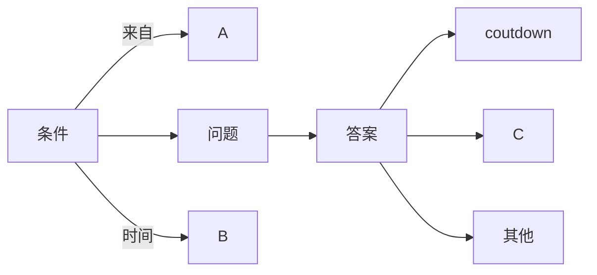

函数想用默认值之前就不能赋值给它，把undefine的值赋值给它也不行。可以if值则赋值

元素的width设成50%还是会超过窗口，因为不包括border,padding和margin

https://www.google.com/search?q=button+same+width+css+flex+display&oq=button+same+width+css+flex+display&aqs=chrome..69i57j33i160l2.10038j0j4&sourceid=chrome&ie=UTF-8#kpvalbx=_GDHRYvDyDM2Fxc8P4uq6gAQ21
