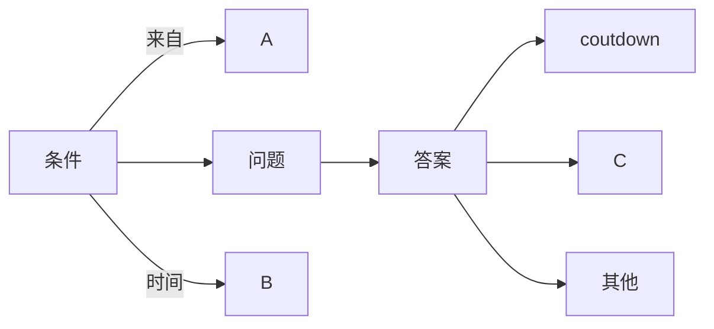
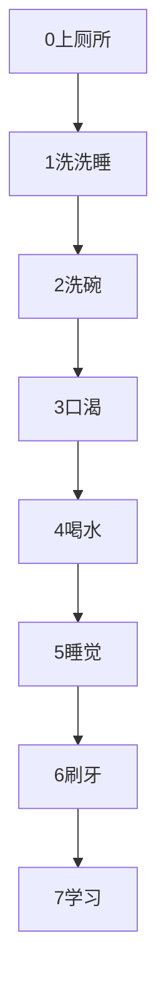

```mermaid
graph LR
条件-->|来自| A
条件-->问题-->答案-->coutdown
条件-->|时间| B
答案-->C
答案-->其他
```

```mermaid
graph TB
0上厕所-->1洗洗睡-->2洗碗-->3口渴-->4喝水-->5睡觉-->6刷牙-->7学习
```

函数想用默认值之前就不能赋值给它，把undefine的值赋值给它也不行。可以if值则赋值
